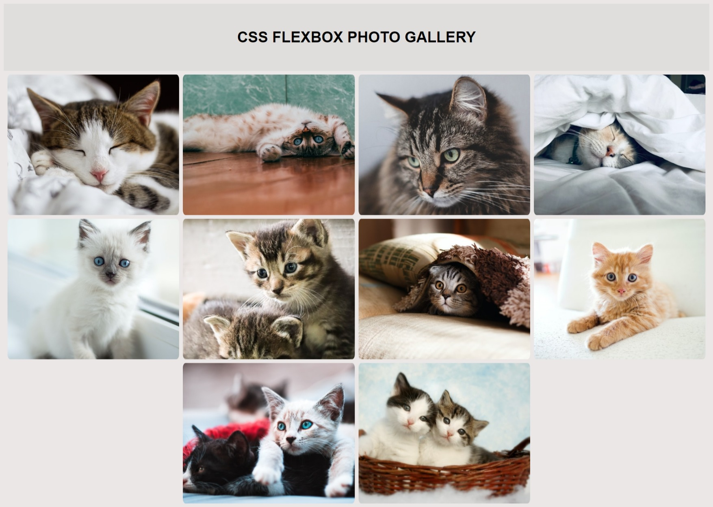

# Aprendendo Flexbox

Flexbox é uma abordagem de layout de CSS unidimensional que se concentra no fluxo de conteúdo. Ele oferece a capacidade de controlar a maneira como os itens são espaçados e alinhados dentro de um container.

O Flexbox ajuda a projetar uma página web para que fique bem em qualquer tela.

Para definir um elemento para que use o Flexbox, é preciso dar a ele a propriedade `display` definida como `flex`.

Podemos pensar o Flexbox como tendo dois eixos, o eixo principal e o eixo transversal. O eixo principal é determinado pela propriedade `flex-direction`. Se `flex-direction` estiver definido como `row` ou `row-reverse`, o **eixo principal é horizontal**. Se `flex-direction` estiver definido como `column` ou `column-reverse`, o eixo principal é vertical.

A propriedade `flex-wrap` determina como seus itens devem se comportar quando o container flex é muito pequeno. Definir esta propriedade como `wrap` permite que os itens sejam envolvidos na próxima linha/coluna(dependendo do seu eixo principal), enquanto `nowrap` impedirá esse movimento. Quando esse valor estiver definido como `nowrap`, os itens poderão escolher para se encaixarem ou ultrapassar o limite.

A propriedade `justify-content` determina como os itens dentro de um container flex são posicionados no eixo principal, afetando a posição e espaço ao seu redor.

A propriedade `align-itens` posiciona o conteúdo do flex ao longo do eixo transversal. No caso, com `flex-direction` definido como `row`, o eixo cruzado seria vertical.

Quando as imagens no flexbox ficam distorcidas. Isto ocorre porque as imagens têm proporções diferentes. Em vez de definir cada proporção individualmente, podemos usar a propriedade `object-fit` para determinar como as imagens devem se comportar. A `object-fit` com o valor `cover` informa a imagem que ela deve preencher o container `img` enquanto matém a proporção, resultando em um corte para o ajuste.